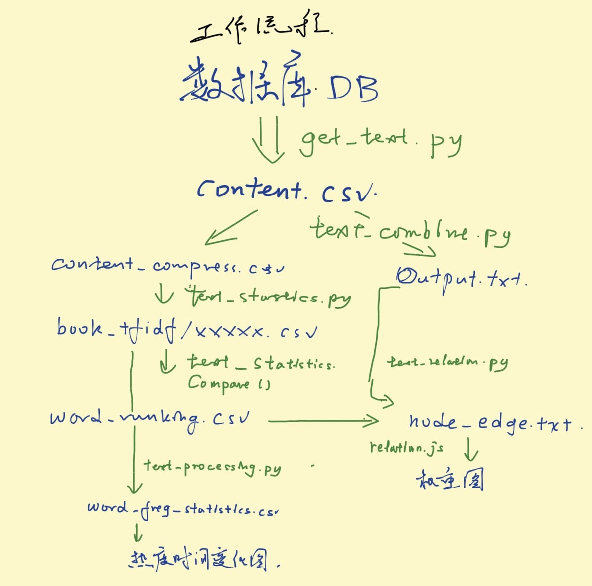

# Text analyse from news source in energy sektor

## what's new
2017/06/30
word frequency statistics for each month or week added

2017/06/26
overall trade result for specific province added, 
word frequency statistics added

2017/06/21
new interface for text and trade results search
, tool for intern usage

2017/06/17
relationship function added, 
better access to database,
user define filter added,
text purify function added.

## workflow
1. get_text.py - 生成分文章全文数据 -> content.csv

2. text_combine.py - 筛选content.csv中的文字 -> content_compress.csv

3. text_combine.py - 利用Combine方法 - 生成全文 -> Output.txt

4. text_statistics.py - content_compress.csv 中的文字， 按周/日归类，寻找高频词 -> book_tfidf/XXXXX.csv / book_tfidf/**week**XXXXX.csv

5. text_statistics.py 利用Compare 方法对比特定时间段频率，选出特定词 -> word_ranking.csv

6. text_processing.py - 对book_tfidf/XXXXX.csv 中特定词频率变化统计 - word_freq_statistic.csv

7. text_relation.py - 利用选出的特定词，寻找词关系 -> node_edge.txt

 